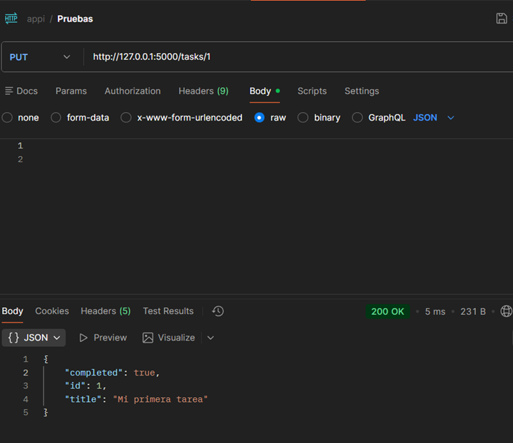

# API REST – Gestión de Tareas

API REST desarrollada en Python utilizando Flask para la gestión de tareas.

## Tecnologías
- Python
- Flask
- JSON
- Git

## Funcionalidades
- Listar tareas
- Crear tareas
- Marcar tareas como completadas
- Eliminar tareas

## Ejecución
1. Instalar dependencias:
```bash
pip install -r requirements.txt

## Pruebas
La API fue probada utilizando Postman para verificar el correcto funcionamiento de los endpoints.
## Evidencia de funcionamiento

Las siguientes imágenes muestran las pruebas realizadas con Postman:



